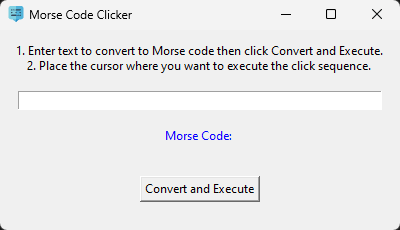

# MorseCodeClicker
<p align="center">
  
</p>

Morse Code Clicker is a Simple Python application that converts text into Morse code and simulates the Morse code transmission using mouse clicks. The application features a graphical user interface (GUI) built with tkinter, allowing users to easily input text and trigger the Morse code clicking sequence, You can use it for Hamster Kombat game on telegram.

## Features

* Text to Morse Code Conversion: Enter any text, and the application will convert it into the corresponding Morse code.
* Mouse Click Simulation: The Morse code is transmitted through mouse clicks, with short and long clicks representing dots and dashes respectively.
* Graphical User Interface: A user-friendly GUI for text input and easy interaction.
* Adjustable Timing: The timing for dots, dashes, and spaces can be easily adjusted to meet different needs.

## Installation

1. Clone the Repository:
```
git clone https://github.com/yourusername/MorseCodeClicker.git
cd MorseCodeClicker
```

2. Install Dependencies:
Ensure you have 'pyautogui' installed:
```
pip install pyautogui
```

## Usage

1. Run the Application:

```
python MorseCodeClicker.py
```

2. Enter Text:

  * Launch the application.
  * Enter the text you wish to convert into Morse code in the provided text box.

3. Start Conversion and Execution:

  * Click the "Convert and Execute" button.
  * Follow the prompt to position the mouse cursor where you want the Morse code clicks to occur.
  * The application will simulate the mouse clicks according to the Morse code.
